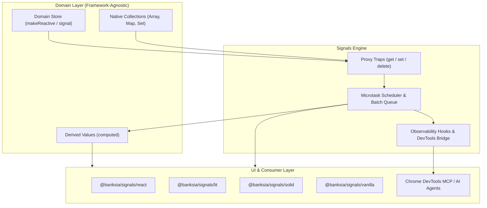
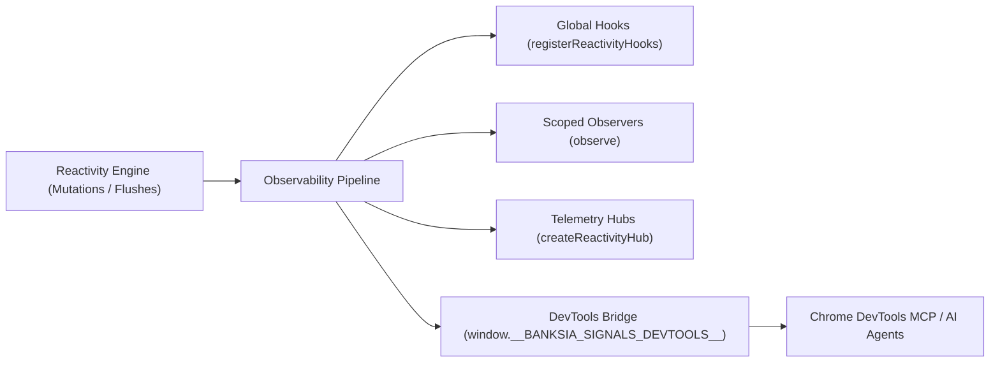

# `@banksia/signals`

> An ultra-fast reactivity engine for the modern web.

[](https://www.typescriptlang.org/)
[](<>)
[](<>)
[](https://banksia-corp.github.io/signals/)

📚 **Interactive Documentation & API Portal**: [https://banksia-corp.github.io/signals/](https://banksia-corp.github.io/signals/)

---

### Highlights

- 🚀 **Ultra-Fast Signals**: Fine-grained dependency tracking and automatic microtask batching update only what changed with zero flicker.
- 📦 **Pure Domain Models**: Standard classes and objects—no decorators, no base classes, no store boilerplate.
- 🔍 **First-Class Observability**: Built-in hooks and telemetry hubs ready for dev tooling and agentic workflows.
- 🔌 **Universal Framework Adapters**: One domain model runs across React, Lit, SolidJS, and Vanilla DOM.
- 🪶 **Zero Dependencies**: Lightweight engine (~2.5 kB minified) with 0 external dependencies.

---

## Table of Contents

- [Overview & Architectural Motivation](#overview--architectural-motivation)
  - [Core Pillars](#core-pillars)
  - [Architecture Topology](#architecture-topology)
- [Installation & Subpath Exports](#installation--subpath-exports)
- [Quickstart in 5 Minutes](#quickstart-in-5-minutes)
- [Core Primitives Deep Dive](#core-primitives-deep-dive)
  - [`makeReactive`, `isReactive`, & `toRaw`](#makereactive-isreactive--toraw)
  - [Standalone Primitives: `signal`, `computed`, & `effect`](#standalone-primitives-signal-computed--effect)
  - [Granular Collection Traps (`Array`, `Map`, `Set`)](#granular-collection-traps-array-map-set)
  - [Transaction Batching (`batch` & `flushBatch`)](#transaction-batching-batch--flushbatch)
- [Multi-Tier Domain Store Architecture](#multi-tier-domain-store-architecture)
- [Framework Adapters](#framework-adapters)
  - [React (`@banksia/signals/react`)](#react-banksiasignalsreact)
  - [Lit (`@banksia/signals/lit`)](#lit-banksiasignalslit)
  - [SolidJS (`@banksia/signals/solid`)](#solidjs-banksiasignalssolid)
  - [Vanilla DOM (`@banksia/signals/vanilla`)](#vanilla-dom-banksiasignalsvanilla)
- [Observability, Telemetry & DevTools Ecosystem](#observability-telemetry--devtools-ecosystem)
  - [Primitive-First Lifecycle Hooks (`registerReactivityHooks`)](#primitive-first-lifecycle-hooks-registerreactivityhooks)
  - [Target-Scoped Observation (`observe`)](#target-scoped-observation-observe)
  - [Dedicated Telemetry Hubs (`createReactivityHub`)](#dedicated-telemetry-hubs-createreactivityhub)
  - [Chrome DevTools MCP & AI Agent Bridge (`@banksia/signals/devtools`)](#chrome-devtools-mcp--ai-agent-bridge-banksiasignalsdevtools)
  - [Chrome DevTools MCP Recipes (`evaluate_script`)](#chrome-devtools-mcp-recipes-evaluate_script)
- [API Reference Matrix](#api-reference-matrix)

---

## Overview & Architectural Motivation

Build your domain model once and plug into your framework of choice.

Traditional state management often ties your business logic directly to a specific UI framework, introducing common architectural bottlenecks:

- **Framework Lock-In**: Tangling domain rules in UI-specific state hooks or stores makes code hard to reuse across micro-frontends or migrate to modern stacks.
- **Boilerplate & Indirection**: Action creators, dispatchers, and reducer ceremony complicate straightforward property mutations.
- **Coarse-Grained Re-rendering**: Updating a single nested property or collection item can trigger broad component re-renders and wasteful diffing cycles.
- **State Glitches & Layout Thrashing**: Uncoordinated synchronous mutations cause transient intermediate states and repeated DOM layout churn.

`@banksia/signals` delivers an **ultra-fast reactivity engine built on fine-grained signals** that solves these challenges with pure JavaScript syntax, automatic dependency tracking, and seamless multi-framework interoperability.

### Core Pillars

1. **Pure Domain Models**: Store classes and state models remain standard, idiomatic TypeScript classes with direct property reads and writes—no decorators, base classes, or store boilerplate.
2. **Ultra-Fast Signals & Automatic Batching**: Dependency edges are dynamically recorded on property access so updates trigger surgical reactions strictly for changed properties and collection indices. Synchronous state mutations across multiple properties collapse into a single microtask turn with zero UI flicker.
3. **First-Class Observability**: Primitive-first lifecycle hooks, target-scoped observers, and telemetry hubs let you inspect state, trace dependency graphs, and audit mutations across developer tooling and agentic workflows.
4. **Universal Framework Portability**: Domain logic lives independently of UI libraries, seamlessly connecting to React, Lit, SolidJS, or Vanilla DOM via dedicated adapter subpaths.
5. **Zero Dependencies & Lightweight Core**: Under ~2.5 kB minified with zero external runtime dependencies, built directly on modern web primitives for maximum runtime speed and minimal bundle footprint.

### Architecture Topology



## Installation & Subpath Exports

```bash
# pnpm
pnpm add @banksia/signals

# npm
npm install @banksia/signals

# yarn
yarn add @banksia/signals

# bun
bun add @banksia/signals

# JSR
npx jsr add @banksia/signals
```

Or in your application's `package.json`:

```json
{
  "dependencies": {
    "@banksia/signals": "workspace:*"
  }
}
```

### Export Subpaths

| Subpath                         | Purpose                          | Key Exports                                                                                                                                               |
| :------------------------------ | :------------------------------- | :-------------------------------------------------------------------------------------------------------------------------------------------------------- |
| **`@banksia/signals`**          | Core reactive engine & telemetry | `makeReactive`, `isReactive`, `toRaw`, `signal`, `computed`, `effect`, `batch`, `flushBatch`, `registerReactivityHooks`, `observe`, `createReactivityHub` |
| **`@banksia/signals/react`**    | React integration hooks & HOCs   | `useReactive`, `observer`, `useSignal`, `useComputed`                                                                                                     |
| **`@banksia/signals/lit`**      | Lit element lifecycle controller | `SignalsController`                                                                                                                                       |
| **`@banksia/signals/solid`**    | SolidJS reactive signal bridge   | `createSolidSignalBridge`                                                                                                                                 |
| **`@banksia/signals/vanilla`**  | Zero-framework DOM bindings      | `bindDOM`, `bindText`                                                                                                                                     |
| **`@banksia/signals/devtools`** | Chrome DevTools MCP & inspection | `initDevTools`, `connectDevTools`, `disconnectDevTools`, `getDevToolsBridge`, `DevToolsBridge`                                                            |

---

## Quickstart in 5 Minutes

Let's build a realistic e-commerce shopping cart domain store, complete with nested collections, derived totals, atomic checkout batching, and a React component.

### 1. Define the Reactive Domain Store

```ts
import { makeReactive, computed } from "@banksia/signals";

export interface CartItem {
  id: string;
  name: string;
  price: number;
  quantity: number;
}

export class CartStore {
  public items: CartItem[] = [];
  public coupons = new Map<string, number>(); // Coupon code -> discount percentage
  public appliedTags = new Set<string>();
  public isCheckingOut = false;

  constructor() {
    return makeReactive(this); // Auto-proxies instance properties and collection methods
  }

  // Derived state automatically recomputes when items or coupons mutate
  public total = computed(() => {
    const subtotal = this.items.reduce(
      (sum, item) => sum + item.price * item.quantity,
      0,
    );
    const discountPercent = Array.from(this.coupons.values()).reduce(
      (acc, d) => acc + d,
      0,
    );
    const discount = subtotal * (discountPercent / 100);
    return Math.max(0, subtotal - discount);
  });

  public addItem(item: CartItem): void {
    const existing = this.items.find((i) => i.id === item.id);
    if (existing) {
      existing.quantity += item.quantity;
    } else {
      this.items.push(item);
    }
  }

  public applyCoupon(code: string, discountPercent: number): void {
    this.coupons.set(code, discountPercent);
  }

  // Multi-property mutations inside methods automatically execute within an atomic batch
  public checkout(): void {
    this.isCheckingOut = true;
    this.items = [];
    this.coupons.clear();
    this.appliedTags.clear();
    this.isCheckingOut = false;
  }
}

export const cartStore = new CartStore();
```

### 2. Connect to a React Component

```tsx
import React from "react";
import { useReactive } from "@banksia/signals/react";
import { cartStore } from "./cart-store";

export const ShoppingCartView: React.FC = () => {
  const cart = useReactive(cartStore);

  return (
    <div className="cart-card">
      <h2>Shopping Cart ({cart.items.length} items)</h2>

      <ul>
        {cart.items.map((item) => (
          <li key={item.id}>
            <span>
              {item.name} x {item.quantity}
            </span>
            <span>${(item.price * item.quantity).toFixed(2)}</span>
            <button onClick={() => item.quantity++}>+</button>
          </li>
        ))}
      </ul>

      <div className="cart-summary">
        <p>
          <strong>Total: ${cart.total.value.toFixed(2)}</strong>
        </p>
        <button
          disabled={cart.items.length === 0 || cart.isCheckingOut}
          onClick={() => cart.checkout()}
        >
          {cart.isCheckingOut ? "Processing..." : "Checkout"}
        </button>
      </div>
    </div>
  );
};
```

---

## Core Primitives Deep Dive

### `makeReactive`, `isReactive`, & `toRaw`

[`makeReactive`](./src/core/proxy.ts) is the foundational transformer. It wraps objects, class instances, arrays, Maps, and Sets into deeply reactive proxies:

- **Nested Reactivity**: Nested objects and collections are wrapped into proxies on-demand upon property access.
- **Method Batching**: Methods called on reactive objects automatically run inside an atomic [`batch`](./src/core/scheduler.ts).
- **Identity Preserved**: Calling `makeReactive` multiple times on the same object returns the cached proxy instance.
- **Non-Trappable Types**: Instances of `Date`, `RegExp`, `Promise`, `Error`, `WeakMap`, and `WeakSet` are preserved without proxy overhead.
- **Raw Extraction**: `toRaw(proxy)` retrieves the underlying raw object for serialization, hashing, or third-party libraries.

```ts
import { makeReactive, isReactive, toRaw } from "@banksia/signals";

const rawData = { user: "Alice", settings: { theme: "dark" } };
const reactiveData = makeReactive(rawData);

console.log(isReactive(reactiveData)); // true
console.log(isReactive(rawData)); // false
console.log(toRaw(reactiveData) === rawData); // true
```

---

### Standalone Primitives: `signal`, `computed`, & `effect`

For granular, standalone values, `@banksia/signals` provides lightweight signal primitives:

```ts
import { signal, computed, effect } from "@banksia/signals";

// 1. Primitive Signal
const count = signal(0);
console.log(count.value); // Read: 0
count.value = 10; // Mutate: triggers dependent reactions

// 2. Computed Derived Value (Lazy & Memoized)
const doubled = computed(() => count.value * 2);
console.log(doubled.value); // Read: 20

// 3. Side-Effect Listener
const dispose = effect(() => {
  console.log(`Current Count: ${count.value}, Doubled: ${doubled.value}`);
  return () => {
    // Optional cleanup function called before re-execution or on disposal
  };
});

// Mutating count automatically triggers the effect
count.value = 15;

// Teardown effect subscription
dispose();
```

---

### Granular Collection Traps (`Array`, `Map`, `Set`)

Mutating native JavaScript collections triggers targeted, key-level or length-level reactive invalidations:

| Collection  | Monitored Operations                                                                  | Mutating Triggers                                                                                   |
| :---------- | :------------------------------------------------------------------------------------ | :-------------------------------------------------------------------------------------------------- |
| **`Array`** | Index access (`arr[0]`), `arr.length`, iteration (`for..of`, `map`, `filter`)         | `.push()`, `.pop()`, `.shift()`, `.unshift()`, `.splice()`, `.sort()`, `.reverse()`, `arr[i] = val` |
| **`Map`**   | `.get(key)`, `.has(key)`, `.size`, iteration (`keys`, `values`, `entries`, `forEach`) | `.set(key, val)`, `.delete(key)`, `.clear()`                                                        |
| **`Set`**   | `.has(value)`, `.size`, iteration (`values`, `forEach`, `Symbol.iterator`)            | `.add(val)`, `.delete(val)`, `.clear()`                                                             |

```ts
import { makeReactive, effect } from "@banksia/signals";

const permissions = makeReactive(new Set<string>(["read"]));
const userRoles = makeReactive(new Map<string, string>([["alice", "admin"]]));

effect(() => {
  console.log("Has write permission:", permissions.has("write"));
});

effect(() => {
  console.log("Alice role:", userRoles.get("alice"));
});

permissions.add("write"); // Triggers permissions effect
userRoles.set("alice", "superadmin"); // Triggers userRoles effect
```

---

### Transaction Batching (`batch` & `flushBatch`)

Coalesce multiple synchronous property mutations into a single reaction turn:

```ts
import { batch, flushBatch } from "@banksia/signals";

// Explicit Batch: delays effect runs until the callback finishes
batch(() => {
  user.firstName = "Ada";
  user.lastName = "Lovelace";
  user.role = "Scientist";
}); // Single microtask reaction fired here

// Synchronous Flush (useful in unit tests or when immediate DOM reads are required)
flushBatch();
```

---

## Multi-Tier Domain Store Architecture

`@banksia/signals` excels in complex enterprise domain models requiring Root Stores, Child Stores, and cross-store computed graphs:

```ts
import { makeReactive, computed, effect } from "@banksia/signals";

export class UserStore {
  public name = "Alice";
  public tier = "premium";
  constructor() {
    return makeReactive(this);
  }
}

export class OrderStore {
  public items: { name: string; price: number }[] = [];
  constructor() {
    return makeReactive(this);
  }
  public addItem(name: string, price: number) {
    this.items.push({ name, price });
  }
}

export class RootStore {
  public user = new UserStore();
  public orders = new OrderStore();

  constructor() {
    return makeReactive(this);
  }
}

const root = new RootStore();

// Cross-Store Computed Property
const checkoutSummary = computed(() => {
  const discountRate = root.user.tier === "premium" ? 0.1 : 0.0;
  const rawTotal = root.orders.items.reduce((sum, item) => sum + item.price, 0);
  const finalTotal = rawTotal * (1 - discountRate);
  return `${root.user.name} owes $${finalTotal.toFixed(2)} (${root.user.tier} discount applied)`;
});

effect(() => {
  console.log(checkoutSummary.value);
});

// Mutating individual child stores automatically recalculates the cross-store graph
root.orders.addItem("Mechanical Keyboard", 150);
root.user.tier = "standard";
```

---

## Framework Adapters

### React (`@banksia/signals/react`)

Provides hooks and Higher-Order Components tailored for React 18 & 19:

```tsx
import React from "react";
import {
  useReactive,
  observer,
  useSignal,
  useComputed,
} from "@banksia/signals/react";
import { rootStore } from "./stores/root-store";

// 1. Hook: Subscribe component to reactive store
export const UserHeader: React.FC = () => {
  const store = useReactive(rootStore);
  return (
    <h1>
      Welcome, {store.user.name} ({store.user.tier})
    </h1>
  );
};

// 2. HOC: Fine-grained Observer component
export const OrderCountBadge = observer(() => {
  return <span className="badge">{rootStore.orders.items.length} items</span>;
});

// 3. Component-local Signals & Computeds
export const QuickCounter: React.FC = () => {
  const count = useSignal(0);
  const quadrupled = useComputed(() => count.value * 4);

  return (
    <button onClick={() => count.value++}>
      Count: {count.value} (Quad: {quadrupled.value})
    </button>
  );
};
```

---

### Lit (`@banksia/signals/lit`)

Integrates with Lit elements through `SignalsController`, managing subscription lifecycles automatically:

```ts
import { LitElement, html } from "lit";
import { customElement } from "lit/decorators.js";
import { SignalsController } from "@banksia/signals/lit";
import { rootStore } from "./stores/root-store";

@customElement("order-summary-widget")
export class OrderSummaryWidget extends LitElement {
  // Automatically attaches hostConnected and hostDisconnected hooks
  private controller = new SignalsController(this, rootStore);

  render() {
    return html`
      <div class="summary-box">
        <h3>User: ${rootStore.user.name}</h3>
        <p>Order Count: ${rootStore.orders.items.length}</p>
      </div>
    `;
  }
}
```

---

### SolidJS (`@banksia/signals/solid`)

Bridges reactive proxy targets into SolidJS's fine-grained JSX accessor system:

```tsx
import { createSolidSignalBridge } from "@banksia/signals/solid";
import { rootStore } from "./stores/root-store";

export function SolidDashboard() {
  const store = createSolidSignalBridge(rootStore);

  return (
    <div>
      <h2>User: {store().user.name}</h2>
      <p>Orders: {store().orders.items.length}</p>
    </div>
  );
}
```

---

### Vanilla DOM (`@banksia/signals/vanilla`)

Lightweight, zero-dependency helpers for native DOM scripting and micro-frontends:

```ts
import { bindText, bindDOM } from "@banksia/signals/vanilla";
import { rootStore } from "./stores/root-store";

// Bind text content directly to reactive expressions
const userLabel = document.querySelector("#user-label") as HTMLElement;
const unbindUser = bindText(
  userLabel,
  () => `Logged in: ${rootStore.user.name}`,
);

// Bind arbitrary DOM properties and styles with reactive updaters
const submitBtn = document.querySelector("#checkout-btn") as HTMLButtonElement;
const unbindDOM = bindDOM(submitBtn, (btn) => {
  btn.disabled = rootStore.orders.items.length === 0;
  btn.textContent = `Checkout (${rootStore.orders.items.length} items)`;
});
```

---

## Observability, Telemetry & DevTools Ecosystem

`@banksia/signals` treats observability as a first-class architectural primitive, providing low-level lifecycle hooks, targeted instance auditing, and a browser DevTools bridge.



### Primitive-First Lifecycle Hooks (`registerReactivityHooks`)

Attach global telemetry pipelines (OpenTelemetry APM, custom metrics, error trackers):

```ts
import { registerReactivityHooks } from "@banksia/signals";

const unregister = registerReactivityHooks({
  // Fired when a consumer (computed/effect) tracks a dependency
  onTrack(source, consumer) {
    console.debug(`[Track] ${consumer.name} -> ${source.meta.label}`);
  },

  // Fired on every property mutation
  onNotify(source, { oldValue, newValue }) {
    console.log(`[Mutation] ${source.meta.label}:`, oldValue, "➜", newValue);
  },

  // Fired during effect or computed execution
  onExecute(consumer, context) {
    if (context.phase === "end") {
      console.debug(`[Executed] ${consumer.name} in ${context.durationMs}ms`);
    }
  },

  // Fired during microtask batch scheduler flushes
  onBatch(stats) {
    if (stats.phase === "flush") {
      console.debug(`[Batch] Flushed ${stats.flushedCount} reactive reactions`);
    }
  },

  // Fired when an error occurs during reactive evaluation
  onError(error, context) {
    console.error(`[Reactivity Error in ${context.phase}]`, error);
  },
});

// Teardown hooks
unregister();
```

---

### Target-Scoped Observation (`observe`)

Observe mutations and reactivity on a specific store or object instance without global noise:

```ts
import { observe } from "@banksia/signals";
import { cartStore } from "./cart-store";

const stopObserving = observe(cartStore, {
  onNotify(source, change) {
    auditLog.record({
      target: "CartStore",
      field: source.meta.property,
      oldValue: change.oldValue,
      newValue: change.newValue,
      timestamp: Date.now(),
    });
  },
});
```

---

### Dedicated Telemetry Hubs (`createReactivityHub`)

Create isolated pipelines with custom filter predicates:

```ts
import { createReactivityHub } from "@banksia/signals";

const analyticsHub = createReactivityHub({
  filter: (source) => !source.meta.isPrivate,
});

analyticsHub.use({
  onNotify(source, change) {
    analyticsClient.track("State Change", {
      property: source.meta.label,
      value: change.newValue,
    });
  },
});
```

---

### Chrome DevTools MCP & AI Agent Bridge (`@banksia/signals/devtools`)

The DevTools bridge binds to `window.__BANKSIA_SIGNALS_DEVTOOLS__` (and `globalThis.__BANKSIA_SIGNALS_DEVTOOLS__`), allowing browser DevTools and autonomous AI agents interacting with the **[Chrome DevTools MCP](https://github.com/ChromeDevTools/chrome-devtools-mcp)** to inspect state, trace dependency graphs, and profile execution performance.

#### Initializing in Your Application

```ts
import { initDevTools } from "@banksia/signals/devtools";
import { rootStore } from "./stores/root-store";

// Initialize runtime bridge
const devtools = initDevTools({
  maxBufferSize: 500, // Bounded ring buffer for mutation events
  sanitizePrivate: true, // Redact private fields (_apiKey -> '[REDACTED_PRIVATE]')
  recordExecuteEvents: true, // Profile effect & computed runtimes
  recordBatchEvents: true, // Track scheduler flushes
});

// Register domain stores with named keys for easy indexing
devtools.registerTarget(rootStore, "RootStore");
devtools.registerTarget(rootStore.user, "UserStore");
devtools.registerTarget(rootStore.orders, "OrderStore");
```

---

### Chrome DevTools MCP Recipes (`evaluate_script`)

Autonomous AI agents and browser automation tools can inspect live application state and performance in an untracked sandbox without registering phantom subscribers:

#### 1. Query Sandboxed State Snapshot

```js
window.__BANKSIA_SIGNALS_DEVTOOLS__.inspectState("UserStore");
```

_Output:_

```json
{
  "name": "Alice",
  "tier": "premium",
  "_sessionSecret": "[REDACTED_PRIVATE]"
}
```

#### 2. Introspect Dependency Graph Topology

```js
window.__BANKSIA_SIGNALS_DEVTOOLS__.inspectGraph();
```

_Output:_

```json
{
  "UserStore": {
    "targetName": "UserStore",
    "properties": {
      "name": { "subscriberCount": 2 },
      "tier": { "subscriberCount": 1 }
    }
  },
  "OrderStore": {
    "targetName": "OrderStore",
    "properties": {
      "items": { "subscriberCount": 3 }
    }
  }
}
```

#### 3. Query Recent Mutation Stream

```js
window.__BANKSIA_SIGNALS_DEVTOOLS__.getRecentMutations(5);
```

_Output:_

```json
[
  {
    "type": "notify",
    "label": "OrderStore.items",
    "property": "items",
    "oldValue": [],
    "newValue": [{ "name": "Mechanical Keyboard", "price": 150 }],
    "timestamp": 1755834720123
  }
]
```

#### 4. Profile Scheduler & Execution Performance

```js
window.__BANKSIA_SIGNALS_DEVTOOLS__.getPerformanceMetrics();
```

_Output:_

```json
{
  "totalBatches": 14,
  "totalMutations": 42,
  "totalExecutions": 88,
  "averageExecutionDurationMs": 0.28,
  "maxExecutionDurationMs": 1.45,
  "errorCount": 0
}
```

---

## API Reference Matrix

| Export                        | Module Subpath              | Type / Signature                                       | Description                                                     |
| :---------------------------- | :-------------------------- | :----------------------------------------------------- | :-------------------------------------------------------------- |
| **`makeReactive`**            | `@banksia/signals`          | `<T>(target: T): T`                                    | Wraps object, class, Array, Set, or Map in deep reactive proxy. |
| **`isReactive`**              | `@banksia/signals`          | `(target: unknown): boolean`                           | Returns true if the target is an active reactive proxy.         |
| **`toRaw`**                   | `@banksia/signals`          | `<T>(target: T): T`                                    | Unwraps a reactive proxy to its underlying raw object.          |
| **`signal`**                  | `@banksia/signals`          | `<T>(initial: T): Signal<T>`                           | Creates a standalone reactive signal container.                 |
| **`computed`**                | `@banksia/signals`          | `<T>(getter: () => T): ReadonlySignal<T>`              | Creates a lazy, memoized computed derived signal.               |
| **`effect`**                  | `@banksia/signals`          | `(fn: EffectFn): DisposeFn`                            | Creates an auto-tracking reactive side-effect listener.         |
| **`batch`**                   | `@banksia/signals`          | `<T>(fn: () => T): T`                                  | Groups state mutations into an atomic batch turn.               |
| **`flushBatch`**              | `@banksia/signals`          | `(): void`                                             | Synchronously flushes pending microtask reactions.              |
| **`registerReactivityHooks`** | `@banksia/signals`          | `(hooks: ReactivityHooks): () => void`                 | Attaches global reactivity telemetry lifecycle hooks.           |
| **`observe`**                 | `@banksia/signals`          | `(target: object, hooks: ReactivityHooks): () => void` | Scopes reactivity lifecycle observation to a target.            |
| **`createReactivityHub`**     | `@banksia/signals`          | `(options?: HubOptions): ReactivityHub`                | Creates an isolated, filterable telemetry hub.                  |
| **`useReactive`**             | `@banksia/signals/react`    | `<T extends object>(target: T): T`                     | React hook subscribing host component to reactive store.        |
| **`observer`**                | `@banksia/signals/react`    | `<P>(Component: ComponentType<P>): FC<P>`              | React HOC transforming component into reactive observer.        |
| **`useSignal`**               | `@banksia/signals/react`    | `<T>(initial: T): Signal<T>`                           | React hook memoizing a component-local signal.                  |
| **`useComputed`**             | `@banksia/signals/react`    | `<T>(getter: () => T): ReadonlySignal<T>`              | React hook memoizing a component-local computed signal.         |
| **`SignalsController`**       | `@banksia/signals/lit`      | `class SignalsController`                              | Lit `ReactiveController` binding reactive stores to elements.   |
| **`createSolidSignalBridge`** | `@banksia/signals/solid`    | `<T>(target: T): () => T`                              | Bridges reactive store into SolidJS signal accessor.            |
| **`bindDOM`**                 | `@banksia/signals/vanilla`  | `(el: Element, updater: (el) => void): () => void`     | Synchronizes DOM element attributes with reactive state.        |
| **`bindText`**                | `@banksia/signals/vanilla`  | `(el: HTMLElement, getter: () => string): () => void`  | Synchronizes element `textContent` with reactive expression.    |
| **`initDevTools`**            | `@banksia/signals/devtools` | `(options?: DevToolsOptions): DevToolsBridge`          | Attaches DevTools inspection bridge to `window`.                |
