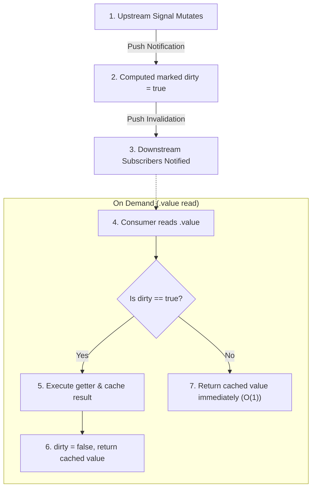
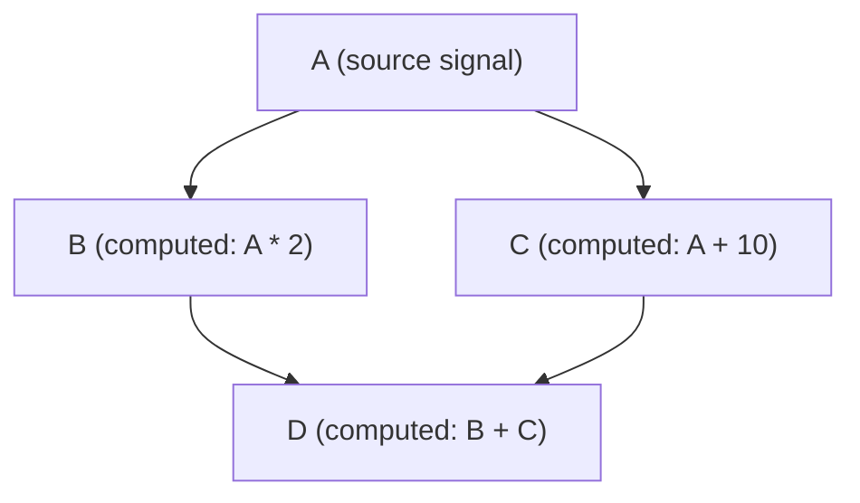

# Computed

A **Computed** primitive produces derived state that is lazily evaluated, dynamically tracked, and automatically memoized. In the reactive architecture, computeds serve as pure transformation pipelines between raw state sources and reactive sinks.

---

## Why Computed? (Architectural Purpose)

In non-reactive or poorly architected applications, derived data is often stored as separate mutable state. This leads to common synchronization bugs:

- Forgetting to update derived values when raw inputs change.
- Inconsistent intermediate states where parts of the UI display outdated calculations.
- Wasteful re-executions calculating values that are never displayed or read.

`computed` solves these problems fundamentally:

1. **Single Source of Truth**: Computeds are pure mathematical projections of upstream state. You only mutate the root data; all derivations update automatically and deterministically.
2. **Lazy "Pull" Evaluation**: A computed function never executes until its `.value` is accessed by an active subscriber or application code. If a derived value is off-screen or unused, zero CPU cycles are spent computing it.
3. **Automatic Memoization**: Once evaluated, the result is cached. Subsequent reads return the cached value in $O(1)$ time without re-running the derivation function.
4. **Glitch-Free Consistency**: Guarantees that downstream subscribers never observe intermediate or "glitched" states in complex dependency graphs.

---

## Basic Usage

```typescript
import { signal, computed } from "@banksia/signals";

const firstName = signal("Grace");
const lastName = signal("Hopper");

// Define a derived computation:
const fullName = computed(() => {
  return `${firstName.value} ${lastName.value}`;
}, "fullName");

// Computed is lazy: the computation runs only when `.value` is read:
console.log(fullName.value); // "Grace Hopper"

// Mutating an upstream dependency invalidates the cache:
firstName.value = "Admiral Grace";
console.log(fullName.value); // "Admiral Grace Hopper"
```

---

## The Push-Pull Lifecycle & Memoization

Computeds operate via a coordinated **push-pull** invalidation lifecycle:



### Execution Step-by-Step

```typescript
const count = signal(0);
let executionCount = 0;

const double = computed(() => {
  executionCount++;
  return count.value * 2;
}, "double");

// 1. Definition phase: getter has NOT run yet:
console.log(executionCount); // 0

// 2. First read triggers evaluation:
console.log(double.value); // 0
console.log(executionCount); // 1

// 3. Subsequent reads use cached value without recomputing:
console.log(double.value); // 0
console.log(double.value); // 0
console.log(executionCount); // 1

// 4. Upstream dependency changes (marks dirty, but does NOT compute yet):
count.value = 5;
console.log(executionCount); // Still 1 (computation is deferred)

// 5. Reading .value executes the getter and updates the cache:
console.log(double.value); // 10
console.log(executionCount); // 2
```

---

## Chaining Derivation Pipelines

Computeds can depend on other computeds to form expressive, highly optimized transformation pipelines. Each stage only invalidates and recalculates when its specific upstream segment changes:

```typescript
import { makeReactive, computed } from "@banksia/signals";

interface Task {
  id: string;
  title: string;
  completed: boolean;
  priority: "high" | "low";
}

const state = makeReactive({
  tasks: [] as Task[],
  filter: "all" as "all" | "active" | "completed",
  sortBy: "priority" as "priority" | "title",
});

// Stage 1: Filter tasks by active status
const filteredTasks = computed(() => {
  if (state.filter === "active") return state.tasks.filter((t) => !t.completed);
  if (state.filter === "completed")
    return state.tasks.filter((t) => t.completed);
  return state.tasks;
}, "filteredTasks");

// Stage 2: Sort the filtered tasks
const sortedTasks = computed(() => {
  return [...filteredTasks.value].sort((a, b) => {
    if (state.sortBy === "priority") {
      return a.priority === "high" ? -1 : 1;
    }
    return a.title.localeCompare(b.title);
  });
}, "sortedTasks");

// Stage 3: Summary metrics
const completedCount = computed(() => {
  return state.tasks.filter((t) => t.completed).length;
}, "completedCount");
```

If `state.sortBy` changes, `sortedTasks` re-evaluates without re-running `filteredTasks`. If a task is toggled, only the relevant stages recalculate.

---

## Glitch-Free Diamond Dependencies

In complex dependency graphs where multiple computation paths diverge from a single source and reconverge downstream, uncoordinated reactive systems suffer from **glitches**—transient states where downstream consumers recompute with a mixture of old and new data:



When `A` changes:

1. In a naïve push system, `D` might evaluate when `B` updates (using new `B` and old `C`), and then evaluate again when `C` updates (producing a transient incorrect intermediate calculation).
2. In `@banksia/signals`, `A` pushes dirty flags down both branches. `D` evaluates only once in topological order when read, guaranteeing 100% glitch-free state consistency.

---

## Dynamic Edge Tracking & Conditional Branches

Dependency tracking occurs dynamically during each evaluation run. If your calculation follows conditional logic, unused dependencies are automatically pruned from the active graph:

```typescript
const useMetric = signal(true);
const celsius = signal(25);
const fahrenheit = signal(77);

const displayTemp = computed(() => {
  if (useMetric.value) {
    return `${celsius.value}°C`;
  } else {
    return `${fahrenheit.value}°F`;
  }
});

// While useMetric is true:
console.log(displayTemp.value); // "25°C"

// Mutating fahrenheit does NOT dirty displayTemp:
fahrenheit.value = 80; // No recalculation scheduled!

// Switching useMetric dynamically establishes tracking for fahrenheit:
useMetric.value = false;
console.log(displayTemp.value); // "80°F"
```

---

## Best Practices & Anti-Patterns

### Recommended Patterns (DO)

- **Keep getters pure and deterministic**: Given the same inputs, a computed function should always produce the exact same output.
- **Use `computed` for all derived state**: Never synchronize derived state manually using effects.
- **Provide diagnostic names**: Passing an optional string name (e.g. `computed(fn, "userName")`) improves readability in Chrome DevTools and observability hubs.

### Anti-Patterns to Avoid (DON'T)

- **DON'T perform side-effects inside getters**: Never make network calls, write to `localStorage`, or mutate DOM inside a computed getter. Use [`effect`](./effects) instead.
- **DON'T mutate reactive state inside getters**: Mutating signals or reactive objects inside a computed getter causes unexpected cycles and violates purity.
- **DON'T duplicate caching**: Do not store timestamps or custom memoization caches inside computed functions—the reactivity engine already handles dependency invalidation optimally.

---

## TypeScript Signatures

```typescript
export interface ReadonlySignal<T> {
  /**
   * The current derived value of the signal.
   *
   * Accessing this property registers a dependency if called within an active reactive context.
   */
  readonly value: T;
}

export function computed<T>(getter: () => T, name?: string): ReadonlySignal<T>;
```
