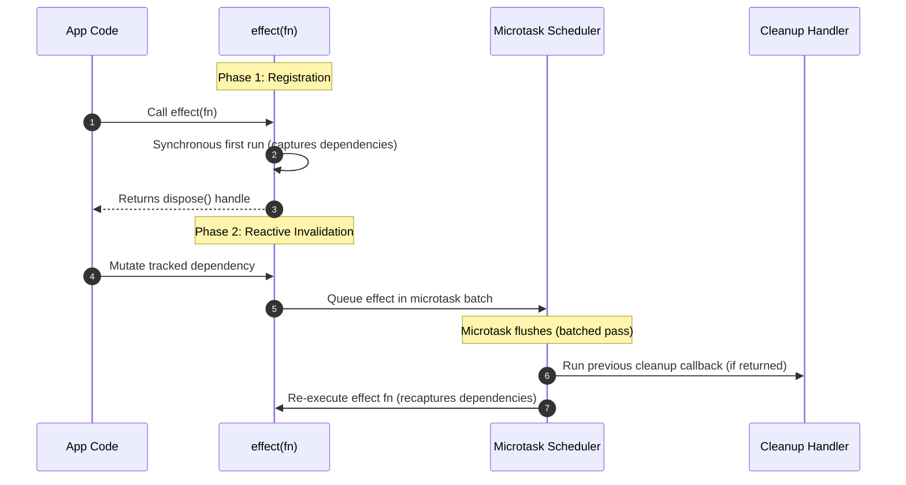

# Effects

An **Effect** creates a reactive observer that executes an arbitrary side-effect function whenever its tracked dependencies change. In the reactive architecture, effects act as the terminal **sinks** that bridge the pure reactive domain with the external, imperative world.

---

## Why Effects? (Architectural Purpose)

While [`signal`](./signals) and [`computed`](./computed) represent pure, referentially transparent reactive state, applications must inevitably interact with external, impure systems. `effect` is the designated gateway for all side-effects:

1. **The Pure-to-Impure Boundary**: Encapsulates interactions with the outside world—such as DOM updates, network requests, WebSockets, `localStorage` persistence, audio/canvas rendering, and logging.
2. **The Engine of Framework Adapters**: Modern view libraries are fundamentally side-effect engines. The framework adapters in `@banksia/signals`—such as React's `useReactive`, Lit's `SignalsController`, SolidJS bridges, and Vanilla DOM's `bindDOM`—are built directly on top of `effect` observers.
3. **Microtask Batching & Coalescing**: When multiple dependencies mutate synchronously within the same event loop tick, effects do not re-run repeatedly. They coalesce into a single execution pass in the microtask queue, preventing layout thrashing and intermediate visual flicker.
4. **Self-Cleaning Resource Lifecycles**: Effects provide built-in lifecycle management, allowing callbacks to return cleanup functions that execute automatically before re-evaluation or upon disposal.

---

## Basic Usage

```typescript
import { signal, effect } from "@banksia/signals";

const theme = signal<"light" | "dark">("light");

// Effect executes synchronously on registration to establish initial dependencies:
const dispose = effect(() => {
  document.body.className = `theme-${theme.value}`;
  console.log(`Updated theme to: ${theme.value}`);
}, "themeWatcher");

// Subsequent mutations schedule execution via the microtask scheduler:
theme.value = "dark";
```

---

## Execution Lifecycle

An effect in `@banksia/signals` follows a predictable dual-phase execution model:



1. **Initial Synchronous Registration**: When `effect(fn)` is called, `fn` executes **immediately and synchronously** on the current tick. This establishes the initial reactive dependency graph.
2. **Microtask-Batched Invalidation**: When any captured dependency mutates subsequently, the effect is flagged and queued in the microtask batch scheduler. Multiple synchronous writes across signals or reactive properties trigger only a single consolidated execution pass.

---

## Resource Lifecycle & Cleanup Management

When an effect acquires stateful external resources (such as DOM event listeners, WebSocket connections, or timers), the callback function can return a **cleanup callback**:

```typescript
import { signal, effect } from "@banksia/signals";

const roomId = signal("room-general");

const stopSync = effect(() => {
  console.log(`Connecting to room: ${roomId.value}`);
  const ws = new WebSocket(`wss://chat.example.com/${roomId.value}`);

  ws.onmessage = (event) => {
    console.log("Incoming message:", event.data);
  };

  // Return teardown / cleanup function:
  return () => {
    console.log(`Closing connection to room: ${roomId.value}`);
    ws.close();
  };
}, "roomSocketWatcher");

// Changing roomId automatically runs the previous cleanup before opening the new connection:
roomId.value = "room-engineering";

// Explicitly unmount and dispose the effect:
stopSync();
```

### When Does Cleanup Execute?

The returned cleanup callback is invoked:

1. **Immediately before the next execution** of the effect when dependencies change.
2. **When the effect is disposed** via the returned `DisposeFn`.

---

## Dynamic Edge Tracking & Conditional Branches

Dependencies are tracked dynamically during each execution turn. If an effect follows conditional branching logic, dependencies that are not accessed in the current branch are automatically unlinked:

```typescript
const isOnline = signal(false);
const userStatus = signal("Available");

effect(() => {
  if (isOnline.value) {
    console.log(`User status: ${userStatus.value}`);
  } else {
    console.log("User is offline");
  }
});

// While isOnline is false, mutating userStatus will NOT trigger the effect:
userStatus.value = "Busy"; // No reaction

// Flipping isOnline to true activates dynamic tracking of userStatus:
isOnline.value = true; // Logs: "User status: Busy"
userStatus.value = "Away"; // Logs: "User status: Away"
```

---

## The Golden Rule: `computed` vs `effect`

A frequent architectural anti-pattern is using an `effect` to manually synchronize derived state between multiple signals:

```typescript
// ❌ ANTI-PATTERN: Using effect to synchronize derived state
const count = signal(2);
const double = signal(0);

effect(() => {
  // Causes extra microtask scheduling passes and risk of cycles:
  double.value = count.value * 2;
});
```

```typescript
// ✅ RECOMMENDED: Use computed for derived state
const count = signal(2);
const double = computed(() => count.value * 2);
```

> [!TIP]
> **Rule of Thumb**:
>
> - If you want to **produce or transform data**, use **[`computed`](./computed)**.
> - If you want to **perform side-effects or update external systems**, use **`effect`**.

---

## Best Practices & Anti-Patterns

### Recommended Patterns (DO)

- **Always return cleanup functions** when setting up timers, event listeners, or network subscriptions.
- **Save the `dispose` handle** and call it when tearing down components or lifecycle scopes to prevent memory leaks.
- **Name your effects** using the optional second argument (e.g. `effect(fn, "domSync")`) to simplify debugging in Chrome DevTools and telemetry hubs.

### Anti-Patterns to Avoid (DON'T)

- **DON'T create circular reactive writes**: Mutating a signal inside an effect that also reads that signal will trigger an infinite re-execution loop unless protected with a guard.
- **DON'T use effects for synchronous calculations**: Effects are batched and scheduled via microtasks; use `computed` for instantaneous, pull-based derived data.

---

## TypeScript Signatures

```typescript
export type EffectFn = () => void | (() => void);
export type DisposeFn = () => void;

export function effect(fn: EffectFn, name?: string): DisposeFn;
```
