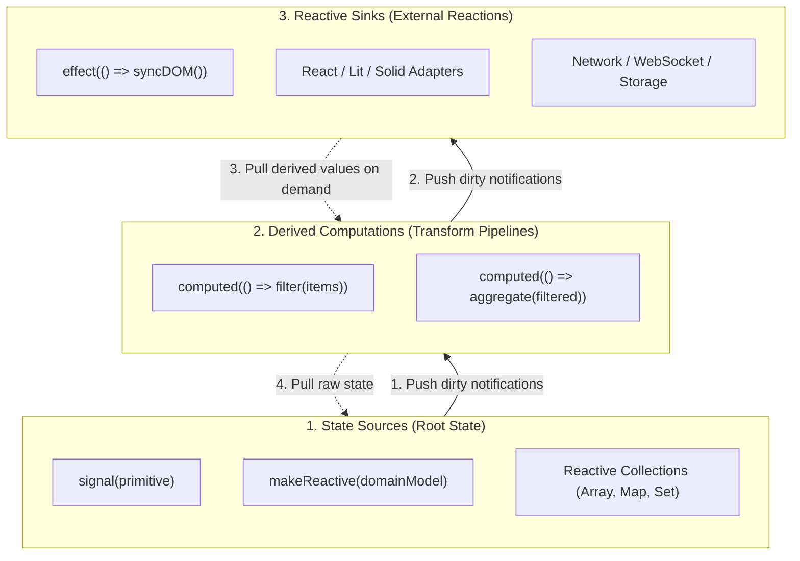
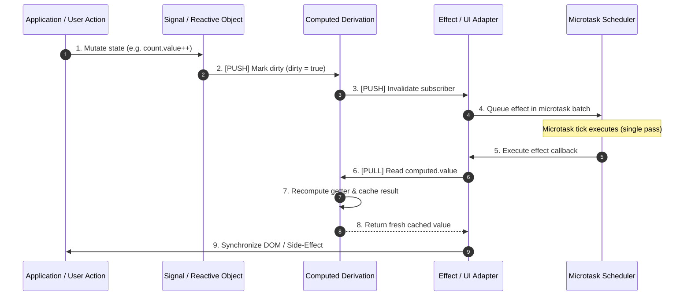

# Reactive Architecture & Mental Model

`@banksia/signals` organizes application state into a high-performance, deterministic **Directed Acyclic Graph (DAG)**. Understanding how state flows through this graph makes it easy to build complex, scalable applications that remain fast and glitch-free.

---

## The Reactive Triad: Sources, Pipelines & Sinks

Every reactive system in `@banksia/signals` is composed of three distinct architectural roles:



### 1. State Sources (Root State)

- **Primitives**: [`signal(value)`](./signals), [`makeReactive(object)`](./reactive-proxies), reactive collections (`Array`, `Map`, `Set`).
- **Nature**: Mutable, stateful root nodes.
- **Purpose**: Hold the canonical single source of truth for your business domain. When a property or signal is modified, it initiates a dirty notification wave through the graph.

### 2. Derived Computations (Transform Pipelines)

- **Primitives**: [`computed(() => expression)`](./computed).
- **Nature**: Pure, lazy, memoized intermediate nodes.
- **Purpose**: Transform, filter, project, and aggregate raw state into ready-to-consume data structures. Computations execute **lazily on demand (pull)** and **cache their results** until an upstream dependency marks them dirty.

### 3. Reactive Sinks (External Reactions)

- **Primitives**: [`effect(() => void)`](./effects), Framework Adapters (`useReactive`, `SignalsController`, `bindDOM`).
- **Nature**: Impure, eagerly scheduled terminal nodes.
- **Purpose**: Bridge the pure reactive world to the outside world. Effects synchronize reactive state changes with DOM rendering, HTTP requests, `localStorage`, WebSockets, Canvas, or telemetry hubs.

---

## The Push-Pull Invalidation Model

Naïve reactive engines often choose between two extremes:

- **Eager Push-Only Systems**: Recalculate every derived value immediately on mutation. This wastes massive CPU cycles recalculating values that might not even be rendered or read.
- **Lazy Pull-Only Systems**: Require polling or manual dirty checking across the entire tree, adding latency and overhead.

`@banksia/signals` implements a state-of-the-art **Push-Pull Invalidation Model**:



1. **Push Phase (Dirty Flagging)**: When a source signal mutates, it pushes a lightweight dirty notification down the graph. Intermediary `computed` nodes flag themselves as dirty (`dirty = true`) and notify their subscribers. Dependent effects are enqueued into the microtask batch. **No computation functions run during this phase.**
2. **Pull Phase (On-Demand Evaluation)**: When the microtask scheduler flushes the queued effect (or when application code reads `.value`), the effect _pulls_ the latest value from its computed dependencies. The computed executes its getter function, updates its cache, clears its dirty flag, and returns the result.

---

## Purity Boundaries: Separation of Concerns

A fundamental architectural principle in `@banksia/signals` is the clear separation between **pure computation** and **impure side-effects**:

```
┌─────────────────────────────────────────────────────────────┐
│                    PURE REACTIVE DOMAIN                     │
│                                                             │
│   Sources (Signals / Objects)  ───►  Computeds (Derivations)│
│   • Referentially transparent                               │
│   • Zero side-effects                                       │
│   • Safe to memoize & evaluate lazily                       │
└──────────────────────────────┬──────────────────────────────┘
                               │ Boundary
┌──────────────────────────────▼──────────────────────────────┐
│                    IMPURE EXTERNAL WORLD                    │
│                                                             │
│   Effects  ───►  DOM / Framework Renders / Network / Storage│
│   • Microtask-batched execution                             │
│   • Explicit resource disposal & teardown                   │
└─────────────────────────────────────────────────────────────┘
```

> [!IMPORTANT]
> **The Golden Rule of Reactivity**:
>
> - Use **`computed`** to derive and transform data without side-effects.
> - Use **`effect`** to communicate with external systems or mutate external state.
> - **Never** mutate signals or perform side-effects inside a `computed` getter.

---

## Architectural Comparison Matrix

| Dimension                | `signal` / `makeReactive`             | `computed`                           | `effect`                        |
| :----------------------- | :------------------------------------ | :----------------------------------- | :------------------------------ |
| **Architectural Role**   | State Source (Root)                   | Transformation Pipeline              | Terminal Sink                   |
| **Execution Trigger**    | Imperative write (`.value = x`)       | On-demand read (`.value`)            | Batched microtask scheduler     |
| **Evaluation Strategy**  | Synchronous assignment                | **Lazy** (pull-evaluated)            | **Eager** (push-scheduled)      |
| **Memoization**          | Holds current value                   | **Cached** until dependency changes  | None (executes callback)        |
| **Purity Requirement**   | Stateful                              | **Must be 100% pure**                | Impure (side-effects expected)  |
| **Disposal / Lifecycle** | Garbage collected                     | Cleaned up when unreferenced         | Returns explicit `DisposeFn`    |
| **Typical Use Cases**    | User inputs, entity models, raw state | Filtering lists, totals, view models | DOM updates, API calls, logging |

---

## Next Steps

Deep-dive into each core primitive:

- **[Signals](./signals)**: Create atomic reactive values and master non-tracking reads.
- **[Computed](./computed)**: Build pure derivation pipelines, memoize calculations, and resolve diamond dependencies.
- **[Effects](./effects)**: Synchronize state with external systems, manage cleanups, and understand scheduling.
- **[Reactive Objects](./reactive-proxies)**: Make TypeScript domain classes, nested objects, and collections reactive with zero decorators.
- **[Batching & Scheduler](./batching-scheduler)**: Understand synchronous transactions, microtask coalescing, and manual flushing.
- **[Telemetry & Hubs](./telemetry-hubs)**: Inspect the dependency graph, capture lifecycle hooks, and build DevTools adapters.
