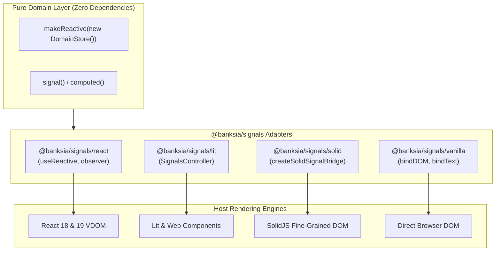

# Framework Adapters

`@banksia/signals` decouples your application's domain logic and state management from UI rendering layers.

By designing your domain stores with standard TypeScript classes, objects, and collections wrapped in `makeReactive()`, your business logic remains 100% framework-agnostic. You can then connect that single reactive source of truth to any modern UI framework using dedicated, zero-overhead adapter subpaths.

---

## The Universal Reactivity Architecture



---

## Supported Framework Ecosystems

| Framework                       | Subpath                    | Key Primitives                                        | Best For                                                            |
| :------------------------------ | :------------------------- | :---------------------------------------------------- | :------------------------------------------------------------------ |
| **[React](./react.md)**         | `@banksia/signals/react`   | `useReactive`, `observer`, `useSignal`, `useComputed` | React 18 concurrent mode, React 19 apps, Next.js, Remix             |
| **[Lit](./lit.md)**             | `@banksia/signals/lit`     | `SignalsController`                                   | Web Components, Design Systems, Shadow DOM Custom Elements          |
| **[SolidJS](./solid.md)**       | `@banksia/signals/solid`   | `createSolidSignalBridge`                             | High-frequency data streams, compile-time fine-grained reactive UIs |
| **[Vanilla DOM](./vanilla.md)** | `@banksia/signals/vanilla` | `bindText`, `bindDOM`                                 | Zero-framework microfrontends, canvas overlays, high-speed widgets  |

---

## Key Benefits of the Adapter Model

### 1. Write Once, Render Anywhere

In multi-framework codebases, microfrontend architectures, or incremental migration projects (e.g., migrating from React to Lit or Solid), domain logic, API clients, and calculation models remain identical across all applications.

```ts
// shared/cart-store.ts - Pure Domain Model
import { makeReactive } from "@banksia/signals";

export class CartStore {
  public items: Array<{ id: string; price: number; quantity: number }> = [];

  constructor() {
    return makeReactive(this);
  }

  get total(): number {
    return this.items.reduce(
      (sum, item) => sum + item.price * item.quantity,
      0,
    );
  }

  public addItem(item: { id: string; price: number; quantity: number }): void {
    this.items.push(item);
  }
}

export const cart = new CartStore();
```

### 2. Microtask-Coalesced Rendering

All adapters tap into the core microtask batch scheduler. When multiple properties mutate in a single synchronous tick, your UI framework only re-renders **once**, eliminating layout thrashing and unnecessary render cascades.

### 3. Granular Subscription Hygiene

Adapters automatically manage subscription lifecycles. When a React component unmounts, a Lit element disconnects from the DOM, or a SolidJS scope is disposed, all internal listener callbacks and dependency edges are automatically torn down to guarantee zero memory leaks.

---

## Explore the Adapters

- ⚛️ **[React Adapter Guide](./react.md)** — Learn how to use `useReactive` and `observer` in functional components.
- ⚡ **[Lit Adapter Guide](./lit.md)** — Integrate reactive domain models with Lit `ReactiveController` lifecycles.
- 🔷 **[SolidJS Adapter Guide](./solid.md)** — Bridge proxy stores into native SolidJS reactive accessors.
- 🍦 **[Vanilla JS & DOM Guide](./vanilla.md)** — Surgically synchronize HTML elements without virtual DOM overhead.
