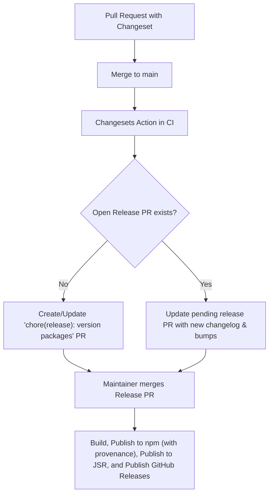

# Semantic Versioning & Changeset Workflow

This document defines the semantic versioning standards, Changeset workflows, and release automation for `@banksia/signals`.

---

## 1. When a Changeset is Required

We use **[Changesets](https://github.com/changesets/changesets)** to manage version bumps, changelog generation, and automated releases.

### A Changeset IS Required For:

- **Bug Fixes**: Any fix to core reactivity, collection traps, scheduling, devtools, or framework adapters.
- **New Features & Capabilities**: New public APIs, helper methods, new adapters, or DevTools enhancements.
- **Breaking Changes**: Any modification to existing API signatures, behavior changes, or deprecated features.
- **Adapter Enhancements**: Updates or additions to React, Lit, SolidJS, or Vanilla DOM integrations.
- **Public Typing Changes**: Alterations to exported TypeScript interfaces or types that impact consumers.

### A Changeset is NOT Required (Optional) For:

- Pure documentation updates (e.g., changes to `README.md`, `docs/`, `AGENTS.md`).
- Internal test suite improvements or additions that do not alter public behavior.
- Internal refactoring without behavioral or performance changes.
- CI/CD workflow updates, dev tooling, or linter configurations (unless a package release is desired).

---

## 2. SemVer Bump Classifications

`@banksia/signals` adheres strictly to [Semantic Versioning 2.0.0](https://semver.org/). When creating a changeset, select the appropriate bump type based on consumer impact:

| Bump Type   | Impact Level                 | Description & Examples                                                                                                                                                                                                                                                                                                                                                   |
| :---------- | :--------------------------- | :----------------------------------------------------------------------------------------------------------------------------------------------------------------------------------------------------------------------------------------------------------------------------------------------------------------------------------------------------------------------- |
| **`major`** | Breaking Changes             | - Modifying or removing core reactive primitives (`signal`, `computed`, `effect`, `makeReactive`).<br>- Altering microtask batch scheduling semantics in a breaking way.<br>- Renaming or removing subpath exports or framework adapter hooks/classes (`useReactive`, `SignalsController`, etc.).<br>- Dropping support for existing framework peer dependency versions. |
| **`minor`** | Backward-Compatible Features | - Introducing a new subpath adapter or integration.<br>- Adding new public utility functions, options, or hooks.<br>- Extending DevTools MCP inspection capabilities without breaking existing signatures.<br>- Adding support for new collection types or runtime platforms.                                                                                            |
| **`patch`** | Backward-Compatible Fixes    | - Bug fixes in proxy traps or collection handling.<br>- Edge-case memory leak or subscription cleanup fixes.<br>- Internal performance optimizations.<br>- TypeScript definition corrections that fix compiler errors for valid usage.                                                                                                                                   |

---

## 3. Creating and Managing Changesets

### Generating a New Changeset

Run the following interactive CLI command:

```bash
pnpm changeset
```

1. **Select Package**: Choose `@banksia/signals`.
2. **Select Bump Type**: Choose `patch`, `minor`, or `major` based on the classification matrix above.
3. **Provide Summary**: Enter a clear, concise description written from the perspective of package consumers.

### Changeset Writing Conventions

- **Clear Consumer Focus**: Explain _what_ changed and _why_ it matters to the developer consuming the package.
- **Include Code Snippets for Breaking Changes**: If introducing a breaking change or deprecation, provide a short migration snippet.
- **Refer to Related Issues**: Include issue or PR numbers if applicable (e.g., `Fixes #17`). When using `@changesets/changelog-github`, PR links and author attributions are automatically enriched.

_Example changeset summary:_

```markdown
---
"@banksia/signals": patch
---

Fix nested Map key deletion notifications inside batched transactions.
```

### Checking Changeset Status

To verify pending changesets and anticipated version bumps before committing:

```bash
pnpm changeset status
```

---

## 4. Release Automation & CI Lifecycle

Releases are fully automated via GitHub Actions in [`.github/workflows/release.yml`](../.github/workflows/release.yml):



1. **Continuous Aggregation**: When PRs with changesets merge to `main`, the Release action aggregates them into a release PR (`chore(release): version packages`).
2. **Release Execution**: When the release PR is merged:
   - Package is built via `pnpm run build`.
   - Published to **npm** with OIDC provenance via [`scripts/release-publish.sh`](../scripts/release-publish.sh) and `pnpm exec changeset publish`.
   - Published to **JSR** via `npx jsr publish`.
   - Official **GitHub Releases** and version tags (e.g. `@banksia/signals@X.Y.Z`) are automatically published to the repository with structured release notes extracted from `CHANGELOG.md` via `changesets/action@v1`.
